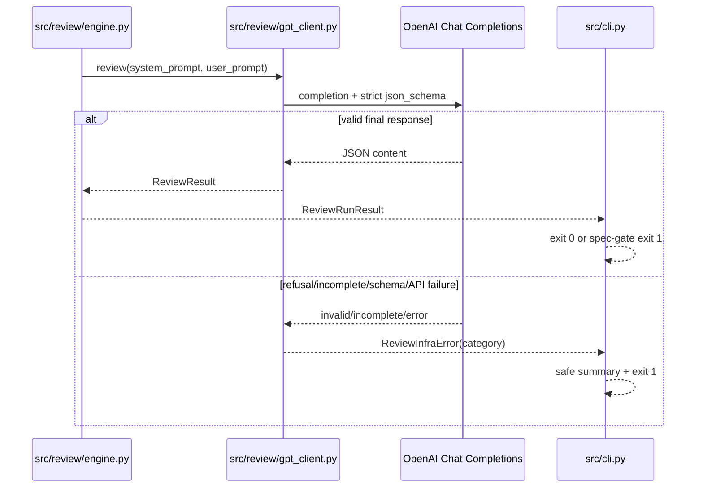

# AI Review Output Contract Hardening Design

## 1. 시스템 개요

기존 Chat Completions review pipeline의 호출 횟수와 finding 정책은 유지하면서 output
contract만 strict JSON Schema로 바꾼다. 오류는 `ReviewInfraError`로 분류해 코드 finding과
reviewer infrastructure failure를 구분한다.

| 항목 | 기술 |
|---|---|
| Runtime | Python 3.11+ |
| API | OpenAI Chat Completions |
| Schema | Pydantic v2 `ReviewResult` |
| Retry | tenacity transport retry only |
| Test | pytest, pytest-asyncio |

## 2. 아키텍처

### 2.1 배포 구조

변경은 `syscon-review-bot` Action 내부에만 구현한다. consumer는 검증된 bot revision을
별도 SR-AMR governance PR에서 SHA pin한다. bot hardening merge 후 consumer pin을 새
검증 SHA로 갱신하는 배포 단계를 분리한다.

### 2.2 정적 구조

```text
src/models/review.py
  └─ ReviewResult.model_json_schema()
          │
          ▼
src/review/structured_output.py
  └─ build_review_response_format()
          │
          ▼
src/review/gpt_client.py
  ├─ one primary completion
  ├─ response/refusal/incomplete validation
  └─ ReviewInfraError
          │
          ▼
src/cli.py
  ├─ REVIEW_INFRA_ERROR log
  ├─ safe Step Summary
  └─ exit 1
```

### 2.3 동적 흐름

1. `GPTClient.review()`이 strict response format으로 기존 completion을 1회 요청한다.
2. tool call이 있으면 기존 loop에서 tool result를 전달하고 final message를 기다린다.
3. final message가 refusal/incomplete이면 typed infra error를 발생시킨다.
4. content는 기존 `prior_resolved` allowlist normalization 후 strict Pydantic validation을
   통과해야 한다.
5. CLI는 typed 오류를 안전하게 요약하고 exit `1`로 종료한다.

## 3. 주요 엔터티

| 엔터티 | 필드/값 | 의미 |
|---|---|---|
| `ReviewInfraCategory` | `OPENAI_TRANSPORT_ERROR` | bounded retry 후 OpenAI API 요청 실패 |
| `ReviewInfraCategory` | `OPENAI_RESPONSE_INCOMPLETE` | refusal, incomplete finish, tool loop 소진 |
| `ReviewInfraCategory` | `RESPONSE_SCHEMA_ERROR` | JSON 또는 Pydantic schema 위반 |
| `ReviewInfraError` | `category`, safe `message` | 원문 응답을 포함하지 않는 infra exception |
| response format | `type=json_schema`, `strict=true` | API output contract |

`ReviewResult`는 내부 test와 postprocess에서 default list를 계속 허용한다. API용 schema를
만들 때만 모든 properties를 required로 변환하고 `default`를 제거한다.

## 4. 주요 기능 상세

### 4.1 Strict schema 생성

`build_review_response_format()`은 `ReviewResult.model_json_schema()` 결과의 copy를 재귀
정규화한다.

- `properties`가 있는 object: 모든 key를 `required`로 설정
- 모든 object: `additionalProperties=false`
- 모든 schema node: `default` 제거
- nested `$defs`, array item, `anyOf`에도 같은 규칙 적용

함수는 module import 시 한 번 계산 가능한 deterministic pure function으로 둔다.

### 4.2 Typed infra error

`gpt_client.py`는 다음 경계만 typed error로 바꾼다.

- OpenAI retryable/API exception: `OPENAI_TRANSPORT_ERROR`
- final content 없음, refusal, `finish_reason`이 정상 종료가 아님:
  `OPENAI_RESPONSE_INCOMPLETE`
- JSON/Pydantic validation 실패: `RESPONSE_SCHEMA_ERROR`

exception message에는 category와 고정된 안전 문구만 넣는다. GPT response 원문은 넣지
않는다.

### 4.3 CLI summary

`src/cli.py`는 `ReviewInfraError`를 별도로 catch한다. stderr에 category와 안전한
reason/stage/unit_id 진단을 기록하고 `GITHUB_STEP_SUMMARY`가 있으면 같은 진단을
HTML 이스케이프하여 append한다. 응답 원문과 예외 체인은 출력하지 않는다.
문맥 전파와 출력 계약 정렬은 `spec/multi-review-contract-diagnostics/design.md`를 따른다.

```text
AI review infrastructure error
Category: RESPONSE_SCHEMA_ERROR
Diagnostic: {"reason": "Internal reviewer did not attest complete file coverage", "stage": "analysis", "unit_id": "shard-2"}
Review completed: no
Code finding produced: no
```

### 4.4 비용 제한

- formatting-only repair call: 0
- parser-triggered full review retry: 0
- judge 기본값: 기존 `false` 유지
- transport retry: 기존 bounded retry 유지
- output schema 외 prompt/finding policy: 변경하지 않음

## 5. 시퀀스 다이어그램



## 6. 핵심 설계 결정

### DEC-01 repair보다 strict generation

잘못된 output을 두 번째 LLM으로 고치지 않고 첫 호출에서 schema를 강제한다. 정상 PR의
호출 수와 비용을 늘리지 않기 위해서다.

### DEC-02 internal model default 유지

기존 test와 code construction을 대규모 변경하지 않도록 `ReviewResult` defaults는
유지한다. API schema projection에서만 strict-required 규칙을 적용한다.

### DEC-03 fail-closed지만 code finding과 분리

infra error는 required review를 완료하지 못했으므로 exit `1`이다. 다만 comment나
summary에서 PR 코드 결함으로 표현하지 않는다.

### DEC-04 finding semantics 동결

blocker/advisory prompt, confidence threshold, 일반 `REQUEST_CHANGES` exit 의미를 이번
변경에서 건드리지 않는다. 생산성 저하를 막기 위한 scope boundary다.

## 7. 인터페이스 요약

| 인터페이스 | 변경 |
|---|---|
| OpenAI `response_format` | `json_object` → strict `json_schema` |
| `GPTClient.review()` | 반환형 유지, typed infra exception 추가 |
| CLI exit | 기존 의미 유지, infra error category 명시 |
| GitHub review body | 변경 없음 |

## 8. 테스트 구조

| 파일 | 검증 |
|---|---|
| `tests/test_structured_output.py` | nested strict schema와 response format |
| `tests/test_gpt_client.py` | request format, 정상 parse, refusal/incomplete/schema/API category, no retry |
| `tests/test_cli.py` | safe `REVIEW_INFRA_ERROR` summary와 exit code |
| 전체 suite | 기존 finding, reviewer, engine 계약 회귀 없음 |

Mock response에는 `finish_reason`, `message.refusal`, `message.content`, `tool_calls`를
명시해 실제 Chat Completions boundary를 표현한다.

## 9. 확장 포인트

운영 telemetry에서 schema failure가 계속 확인될 때만 별도 spec으로 formatting-only
repair 1회를 검토한다. AI finding을 merge blocker로 승격하려는 경우에는 별도
golden-set/eval spec을 먼저 승인해야 한다.
