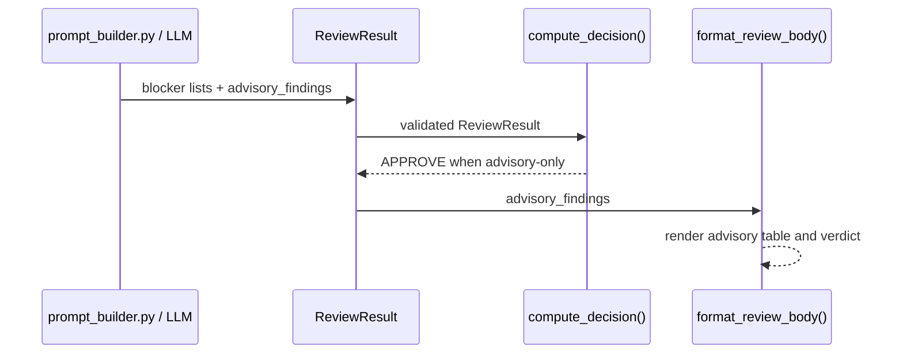

# AI Review Blocker/Advisory Triage Design

## 1. 시스템 개요

기존 review pipeline에 비차단 `advisory_findings` lane을 추가한다. LLM은 정상 workflow에서 재현되는 실제 계약 위반을 기존 blocker 목록에 두고, 인위적 state 변조에서만 발생하는 방어 제안은 advisory로 분리한다.

| 항목 | 기술 |
|---|---|
| 모델 | Pydantic `ReviewResult`, `AdvisoryFinding` |
| 판정 | `src/review/decision.py` |
| prompt | `src/review/prompt_builder.py` |
| 출력 | `src/github/reviewer.py` |
| 검증 | pytest |

## 2. 아키텍처

### 2.1 배포 구조

`syscon-review-bot` GitHub Action 내부 변경으로 배포한다. 소비 저장소는 기존 action 호출을 유지하며, bot release가 검증된 뒤 tag/SHA를 고정하는 작업은 후속 배포 단계로 둔다.

### 2.2 정적 구조

```text
src/review/prompt_builder.py
        │ ReviewResult JSON
        ▼
src/models/review.py
  ├─ blocker lists (existing)
  └─ advisory_findings (new)
        │
        ├─ src/review/decision.py   advisory ignored for blocking
        └─ src/github/reviewer.py  advisory section rendered
```

### 2.3 동적 흐름

LLM은 finding 등록 전 정상 workflow 재현 가능성을 확인한다. 실제 계약 위반이면 기존 category에 기록하고, 손상 state를 직접 만들어야만 발생하면 `advisory_findings`에 기록한다. `compute_decision()`은 기존 blocker 목록만 사용한다.

## 3. 주요 엔터티

| 엔터티 | 필드 | 의미 |
|---|---|---|
| `AdvisoryFinding` | `file`, `line`, `description`, `suggestion`, `confidence` | 비차단 개선 제안 |
| `ReviewResult.advisory_findings` | `list[AdvisoryFinding]` | review의 advisory lane |
| `Decision` | 기존 `APPROVE`, `REQUEST_CHANGES` | 변경 없음 |

`advisory_findings`는 빈 목록을 기본값으로 사용해 기존 LLM 응답 및 테스트와 호환한다. Extra field 금지 정책은 유지한다.

## 4. 주요 기능 상세

### 4.1 Finding 분류

Blocker 조건은 정상 사용자 입력, 정상 저장 API 또는 명시된 계약 경로에서 재현 가능한 위반이다. 테스트가 state JSON을 직접 손상하거나 timestamp/history를 조작해야만 재현되는 경우는 advisory다.

### 4.2 재리뷰 안정성

이전 advisory가 해결되지 않았다는 사실만으로 blocker로 승격하지 않는다. 현재 diff에서 정상 workflow 재현 근거가 새로 확인된 경우에만 기존 blocker 목록으로 이동할 수 있다.

### 4.3 판정

`compute_decision()`은 기존 blocker 조건을 그대로 사용한다. `advisory_findings`는 comment에 표시되지만 decision에는 참여하지 않는다.

### 4.4 출력

Advisory가 있으면 `### 참고 사항 (Advisory)` 표를 출력한다. 판정 라벨은 blocker 유무에 따라 기존 방식으로 계산한다.

## 5. 시퀀스 다이어그램



## 6. 핵심 설계 결정

### DEC-01 별도 advisory lane

기존 category에 `blocking: bool`을 반복 추가하지 않고 `advisory_findings`를 별도 목록으로 둔다. 기존 blocker schema와 decision 계약을 최소 변경으로 보존한다.

### DEC-02 Prompt와 deterministic decision 분리

재현 가능성 판단은 LLM prompt가 담당하고, advisory가 decision에 영향을 주지 않는 규칙은 deterministic Python 코드가 보장한다.

### DEC-03 review 횟수 제한 제외

Bot은 한 실행의 판정만 소유한다. 최대 2회 remediation은 소비 repository agent 정책으로 관리하며 GitHub event suppression은 이번 변경에 포함하지 않는다.

## 7. 인터페이스 요약

JSON output에 다음 optional/default field가 추가된다.

```json
{
  "advisory_findings": [
    {
      "file": "path/or/null",
      "line": 10,
      "description": "정상 workflow와 무관한 방어 제안",
      "suggestion": "별도 hardening PR에서 검토",
      "confidence": 85
    }
  ]
}
```

## 8. 테스트 구조

| 파일 | 검증 |
|---|---|
| `tests/test_models.py` | advisory model/default/schema |
| `tests/test_decision.py` | advisory-only approve, 기존 blocker 유지 |
| `tests/test_prompt_builder.py` | 분류·재리뷰·JSON schema 지침 |
| `tests/test_reviewer.py` | advisory section과 verdict 출력 |

## 9. 확장 포인트

필요하면 후속 변경에서 `.github/review-bot.yml`로 advisory policy를 configurable하게 만들 수 있다. 이번 변경은 과도한 malformed-state blocker를 막는 canonical default만 제공한다.
