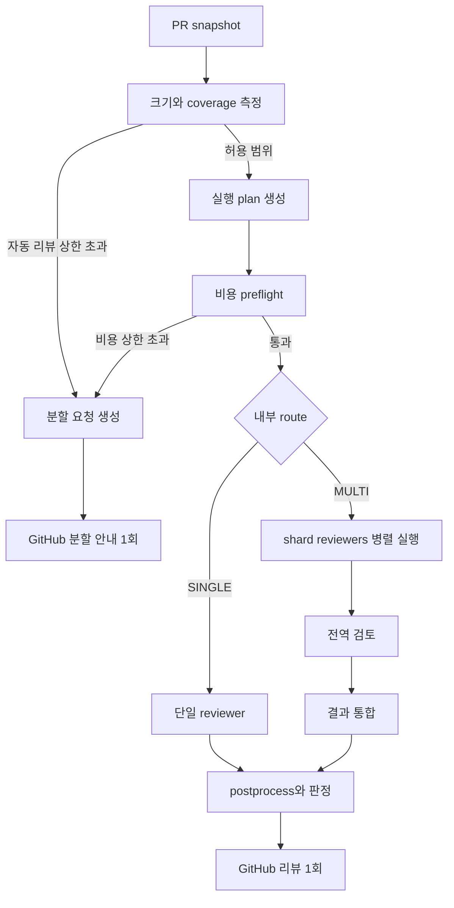

# 대형 PR 분할 리뷰 및 비용 제어 설계

## 1. 목표와 범위

PR 크기에 따라 내부적으로 단일 또는 병렬 리뷰를 선택한다. 두 경로 모두 최종적으로 기존 `ReviewResult` 하나를 만들고 GitHub 리뷰 하나를 게시한다. 자동 리뷰 상한을 넘거나 안전한 비용 범위에서 완전한 리뷰를 만들 수 없으면 코드 finding을 생성하지 않고 PR 분리를 요청한다.

이번 설계는 다음을 포함한다.

- 결정론적 PR 크기 측정과 routing
- 내부 shard 생성 및 병렬 review
- 전역 검토와 최종 통합
- PR별 공유 비용 원장과 호출 예약
- 분할 요청 결과와 운영 telemetry

기존 `ReviewResult`, 리뷰 표 형식, `APPROVE`/`REQUEST_CHANGES` 판정 규칙은 외부 계약으로 유지한다.

## 2. 핵심 결정

### DEC-01 내부 실행 방식 비공개

`SINGLE`과 `MULTI`는 내부 routing 값이다. shard reviewer는 GitHub client를 받지 않는다. `engine.py`의 마지막 publish 단계만 리뷰를 게시할 수 있다.

### DEC-02 상한 초과 시 부분 리뷰 금지

변경 파일을 누락하거나 비용 때문에 필수 단계를 생략한 결과는 게시하지 않는다. 정상 리뷰 대신 결정론적 분할 요청을 게시한다. 큰 파일을 제거한 뒤 전체 PR을 승인하는 fallback은 허용하지 않는다.

### DEC-03 비용 정책은 신뢰된 입력

현재 repository 설정은 PR head에서 읽으므로 PR 작성자가 수정할 수 있다. 비용 hard limit, 허용 모델, 가격표, 최대 호출 수는 Action input 또는 Action 코드의 기본값으로 관리한다. PR의 `.github/review-bot.yml`은 이 값을 낮출 수만 있다.

### DEC-04 보수적 preflight

cache hit은 보장되지 않으므로 preflight는 모든 입력을 uncached 가격으로 계산한다. 실제 비용만 API usage의 cached token 값을 반영한다.

### DEC-05 최종 통합 예약

병렬 reviewer를 시작하기 전에 최종 통합 호출 비용을 먼저 예약한다. reviewer 결과는 만들었지만 통합 비용이 없어 리뷰를 게시하지 못하는 상태를 방지한다.

## 3. 처리 흐름



### 3.1 Snapshot

한 실행은 최초 조회한 `head_sha`에 고정한다. config, 파일 본문, tool 조회도 같은 SHA를 사용한다. Routing 전에 다음을 확보한다.

- PR title, body, base, head SHA
- ignore 적용 전후 전체 파일 inventory
- raw patch, additions, deletions, file status
- spec 파일과 과거 review/comment snapshot
- patch 누락 및 GitHub files API inventory 완전성

필수 production/test/spec 파일의 patch가 없거나 `changed_files`와 가져온 inventory가 다르면 `INCOMPLETE_DIFF`로 분할 요청한다. binary는 리뷰 대상과 크기 계산에서 제외한다. rename-only는 이전·새 경로 metadata를 text patch로 만들어 coverage에 포함한다.

### 3.2 크기 측정

측정은 ignore 적용 후, hunk 확장과 compression 전에 수행한다.

```text
file_weight:
  production/default = 1.00
  test                = 0.60
  docs/spec           = 0.35
  explicit ignore     = 0.00

effective_lines = Σ file_weight × (additions + 0.5 × deletions)
effective_files = Σ file_weight
effective_tokens = ceil(Σ file_weight × tokens(raw_patch))
```

generated, vendor, lock 파일은 기존 ignore 규칙에 명시된 경우에만 0으로 처리한다. 경로 이름만 보고 임의 제외하지 않는다.

초기 routing 기본값:

| Route | 가중 변경량 | 유효 파일 | raw diff tokens | 처리 |
|---|---:|---:|---:|---|
| SINGLE | `≤1,200` | `≤40` | `≤40,000` | 단일 reviewer |
| MULTI | `≤2,500` | `≤80` | `≤100,000` | 2–4 shard reviewer + 전역 검토 + 통합 |
| SPLIT_REQUEST | 하나라도 MULTI 상한 초과 | | | LLM 호출 없이 PR 분리 요청 |

개별 파일이 shard 최대 30,000 tokens를 넘거나 4개 shard 안에 넣을 수 없으면 `UNPACKABLE_CHANGE`로 분리 요청한다. Boundary 값은 허용한다.

### 3.3 Sharding

LLM planner는 비용과 비결정성을 늘리므로 사용하지 않는다.

1. `spec/<feature>/`, `apps/<name>/`, `services/<name>/`, `packages/<name>/`을 우선 component anchor로 사용한다.
2. production 파일과 연관 test/spec 파일을 같은 group에 둔다.
3. root config와 공통 문서는 모든 reviewer가 보는 shared context로 둔다.
4. group을 effective token 내림차순으로 정렬한다.
5. stable first-fit-decreasing 방식으로 최대 4개 shard에 배치한다.
6. 모든 파일은 정확히 한 shard가 소유한다. 전체 file manifest는 모든 reviewer가 받는다.

shared context의 raw token은 모든 shard 입력 한도에 반복 반영한다. 전역 reviewer는 tool 사용 여부와 관계없이 전체 파일에 공정 배분한 bounded patch를 받아 교차 파일 판단의 최소 근거를 확보한다.

각 shard는 자기 patch를 상세 검토하고, 관련 파일이 필요하면 SHA에 고정된 `read_file`/`grep`을 사용한다. 별도 전역 reviewer는 spec 일관성, 모듈 경계, API 호환성, transaction, 권한, 동시성, 이전 리뷰 상태를 검토한다.

### 3.4 내부 결과와 통합

외부 `ReviewResult`를 shard 응답으로 재사용하지 않는다. 새 내부 모델을 사용한다.

```python
class ReviewPartial(BaseModel):
    unit_id: str
    covered_paths: list[str]
    findings: list[ScopedFinding]
    prior_resolved: list[str] = []

class ReviewPlan(BaseModel):
    route: Literal["single", "multi", "split_request"]
    head_sha: str
    units: list[ReviewUnit]
    coverage: CoverageReport
    cost_ceiling_nusd: int
```

통합 단계는 다음을 수행한다.

1. plan의 모든 required unit과 파일 coverage 확인
2. file, line, category, 정규화된 description으로 중복 제거
3. 같은 문제의 severity가 충돌하면 더 높은 severity 유지
4. `prior_resolved`와 현재 finding 충돌 제거
5. 원래 파일 순서와 line 순서로 stable sort
6. strict schema의 최종 `ReviewResult` 생성
7. optional judge가 있으면 실행
8. judge 이후 최종 `postprocess`
9. deterministic `compute_decision`

required unit 하나라도 실패하면 결과 통합과 정상 리뷰 게시를 중단한다. 부분 결과로 approve하지 않는다.

## 4. 비용 제어

### 4.1 가격 표현

부동소수점 대신 nano-USD 정수를 사용한다. 초기 `gpt-5.4-mini` 가격표:

```text
uncached input =   750 nUSD/token
cached input   =    75 nUSD/token
output         = 4,500 nUSD/token
```

```text
cost_nusd =
  (prompt_tokens - cached_tokens) × 750
  + cached_tokens × 75
  + completion_tokens × 4,500
```

가격표에는 `model`, `effective_from`, `version`을 함께 저장한다. 비용 제어가 켜진 상태에서 가격을 모르는 모델은 실행하지 않는다.

### 4.2 기본 trusted policy

```yaml
cost_control:
  enabled: true
  hard_limit_usd: "1.00"
  warning_ratio: "0.80"
  preflight_margin_bps: 1500
  allowed_models: [gpt-5.4-mini]
  max_requests_per_pr: 12
  max_completion_tokens_per_call: 4096
  max_tool_result_tokens_per_call: 4096
  max_history_tokens: 12000
```

PR 설정과 trusted policy가 모두 있으면 각 제한의 더 작은 값을 적용한다. PR 설정은 `enabled=false`, 가격 변경, allowlist 확장, 상한 증가를 할 수 없다.

리뷰 설정은 PR head가 아니라 base commit의 SHA에서 읽는다. 현재 PR은 자기 리뷰의 도구 사용, reasoning, spec gate 또는 비용 정책을 변경할 수 없다. 설정 파일이 없다는 404만 기본값을 사용하며, 인증·통신·서버 오류는 인프라 오류로 종료한다.

### 4.3 실행 계획과 preflight

첫 API 호출 전에 exact execution plan을 만든다.

- reviewer unit과 역할
- unit별 최대 API 요청 수
- tool iteration과 tool result token 상한
- judge 활성 여부
- 최종 통합 호출
- call별 input envelope와 output cap

각 tool turn은 이전 message, assistant output 상한, tool result 상한이 누적된다고 계산한다. 계산 결과에 15% margin을 더한다. cache 할인은 적용하지 않는다.

```text
preflight_cost = ceil(worst_case_call_costs × 1.15)
```

최소한의 완전한 review plan도 `$1.00`을 초과하면 `COST_LIMIT` 분할 요청으로 종료한다. 비용을 맞추려고 required reviewer나 파일을 조용히 제거하지 않는다.

### 4.4 공유 CostLedger

모든 병렬 unit은 하나의 `CostLedger`를 사용한다.

```text
reserve(call_id, worst_case_cost)
actual_spend + active_reservations + requested ≤ hard_limit
```

`reserve()`와 `reconcile()`은 `asyncio.Lock`으로 보호한다. 응답 후 `usage.prompt_tokens`, `usage.prompt_tokens_details.cached_tokens`, `usage.completion_tokens`로 실제 비용을 확정한다.

usage가 없는 실패는 예약액 전체를 `usage_unknown`으로 유지한다. 다음 retry도 새 예약을 받아야 한다. 실제 비용이 예약액보다 크면 시작하지 않은 호출을 중단하고 이미 실행 중인 호출만 정산한다.

### 4.5 비용 초과 결과

| 시점 | OpenAI 호출 | 외부 결과 |
|---|---:|---|
| size preflight 초과 | 0 | PR 분할 요청 1개 |
| cost preflight 초과 | 0 | PR 분할 요청 1개 |
| runtime 예약 실패 | 진행분까지만 | 부분 finding 없이 비용 상한/PR 분할 안내 1개 |
| required unit 실패 | 진행분까지만 | 정상 리뷰 게시 안 함, infrastructure failure |

비용 초과 안내에는 측정값, 상한, reason code, 권장 shard group만 포함한다. 내부 reviewer 응답이나 부분 finding은 포함하지 않는다.

## 5. 외부 출력 계약

정상 SINGLE/MULTI 성공은 모두 기존 `format_review_body(ReviewResult)`를 사용한다. 내부 route, agent 수, shard 수, agent별 비용은 본문에 표시하지 않는다.

분할 요청은 별도 deterministic formatter를 사용한다.

```markdown
## 🤖 AI 리뷰

### 판정: 🚫 PR 분할 필요

> 자동 리뷰 가능 범위를 초과했습니다.

측정: 가중 변경량 2,840줄 / 유효 파일 61개 / raw diff 112,400 tokens
기준: 가중 변경량 2,500줄 / 유효 파일 80개 / raw diff 100,000 tokens

기능 또는 독립 배포·롤백 단위로 PR을 분리해주세요.
```

한 workflow run에서 publish 함수 호출은 최대 한 번이다. GitHub POST API에는 idempotency key가 없으므로 네트워크 응답 유실이나 workflow 재실행까지 포함한 절대적인 exactly-once는 보장할 수 없다. `head_sha`가 포함된 숨김 marker를 사용해 동일 SHA의 중복 게시를 best-effort로 방지한다.

모든 review POST는 snapshot SHA를 `commit_id`로 지정한다. 중복 검사는 marker뿐 아니라 GitHub Actions bot 작성자도 확인하며, reviews 목록 전체를 pagination해 조회한다.

## 6. 오류 모델

새 infrastructure/policy category:

- `INCOMPLETE_DIFF`
- `UNPACKABLE_CHANGE`
- `SIZE_LIMIT`
- `COST_PREFLIGHT_EXCEEDED`
- `COST_RUNTIME_EXCEEDED`
- `PIPELINE_PARTIAL_FAILURE`
- `PIPELINE_REDUCTION_CONFLICT`

Size/cost/unpackable 조건은 사용자 조치가 가능한 policy outcome으로 분할 안내를 게시한다. provider transport, schema, reduction 오류는 기존 infrastructure failure로 처리하며 코드 결함 판정을 만들지 않는다.

## 7. 코드 변경 지도

| 파일 | 변경 |
|---|---|
| `src/models/config.py` | size routing의 낮출 수 있는 repository 설정 추가 |
| `src/models/review_pipeline.py` | `ReviewPlan`, `ReviewUnit`, `ReviewPartial`, coverage 모델 추가 |
| `src/review/size_router.py` | metrics, route, reason code, deterministic packing |
| `src/review/cost.py` | pricing, estimator, `CostLedger`, usage accounting |
| `src/review/pipeline.py` | 병렬 실행, 전역 review, reduction |
| `src/review/gpt_client.py` | output cap, usage 수집, call reservation/reconcile |
| `src/review/prompt_builder.py` | shard/global/synthesis prompt 추가 |
| `src/review/engine.py` | snapshot, plan, pipeline 호출, 단일 publish authority |
| `src/github/reviewer.py` | deterministic split-request formatter 추가 |
| `src/cli.py`, `action.yml` | trusted cost/size policy 입력과 Step Summary |

외부 `ReviewResult`, `structured_output.py`, 정상 review formatter는 가능한 한 변경하지 않는다.

## 8. 관측성

구조화 로그와 GitHub Step Summary에 다음만 기록한다.

- run id, repo, PR, head SHA
- routing reason과 raw/effective metrics
- policy, pricing, estimator version
- stage, model, call/attempt/tool iteration 수
- estimated, reserved, actual nano-USD
- prompt, cached, completion token 수
- 누적 비용, 상한 사용률, stop reason
- shard coverage와 누락 경로 수

prompt 본문, patch, comment, tool 결과, API key, 모델 원문은 기록하지 않는다.

## 9. 테스트 전략

### 크기와 routing

- production/test/docs weight와 add/delete 계산
- exact boundary 허용과 threshold 초과
- input 순서와 무관한 stable shard 결과
- 모든 파일 정확히 한 shard 소유
- 개별 대형 파일과 4-shard packing 실패
- binary 제외, rename metadata, patch 누락, inventory mismatch
- compression에서 dropped path 발생 시 정상 리뷰 금지

### 비용

- uncached/cached/output nano-USD 계산
- cache 미반영 preflight와 15% margin
- Korean/multibyte prompt estimator 결정성
- tool turn마다 input envelope 단조 증가
- output cap과 tool result/history cap 적용
- 병렬 reserve race에서 shared hard limit 불변식
- retry와 missing usage의 보수적 정산
- PR 설정이 trusted cap을 올리거나 끄지 못함

### Pipeline과 publish

- SINGLE: 정상 GPT 결과와 GitHub POST 1회
- MULTI: N개 partial 완료와 GitHub POST 1회
- 완료 순서가 달라도 동일한 최종 결과
- SPLIT_REQUEST: GPT 0회와 GitHub POST 1회
- cost preflight 초과: GPT 0회와 GitHub POST 1회
- runtime budget 초과: partial finding 0개와 안내 POST 1회
- required unit 실패: 정상 review POST 0회와 typed infra error
- judge 사용 시 judge 이후 postprocess 수행

## 10. 단계적 구현

1. 크기 metrics, route, split formatter를 구현한다.
2. pricing, preflight estimator, CostLedger와 usage accounting을 구현한다.
3. 내부 partial schema, sharding, parallel pipeline, reducer를 구현한다.
4. 단일 publish authority와 Step Summary를 연결한다.
5. 운영 로그만 수집하는 shadow mode로 2주간 threshold와 비용 추정 오차를 측정한다.
6. 측정 후 routing과 split enforcement를 활성화한다.

Shadow mode에서도 비용 hard limit은 적용한다. Shadow mode는 size route 결과만 게시 동작에 반영하지 않는다.
